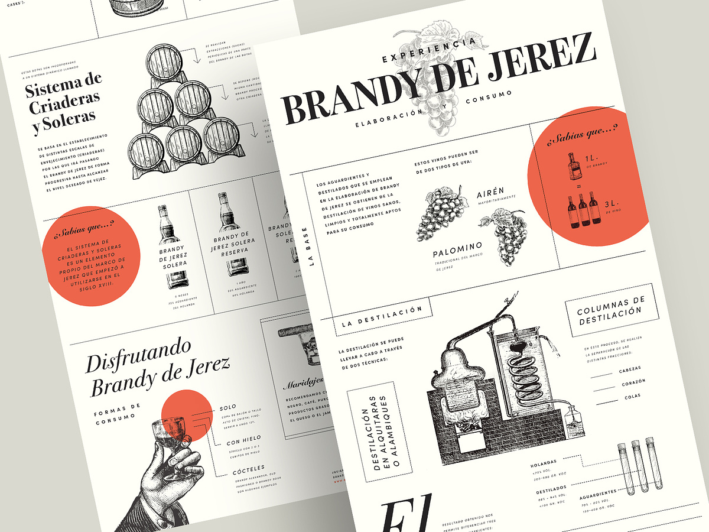

# Making of CodeConnect

| Why     | WHat  | How     |
| ------- | ----- | ------- |
| Damn    | ur    | amazing |
| AND     | VERY  | nice    |
| chahiye | momos | mereko  |

[https://nextcloud.com/](https://nextcloud.com/) ye bhi theek hai

#### hw

## damn

> quotes and all damn

***

Lorem ipsum dolor sit amet, consectetur adipiscing elit. Maecenas sit amet vulputate nunc. Quisque egestas justo vitae lectus commodo dapibus. Proin lorem risus, consectetur sed bibendum quis, pulvinar vel nulla. Aliquam lobortis laoreet purus in condimentum. Aliquam suscipit egestas viverra. Vestibulum ante ipsum primis in faucibus orci luctus et ultrices posuere cubilia curae; Aenean congue odio posuere ultricies eleifend. Etiam nulla urna, vestibulum mollis libero id, ullamcorper euismod urna. Praesent in felis mattis, hendrerit dui sit amet, pulvinar odio. Praesent pulvinar rutrum gravida. Fusce rutrum diam vitae porta accumsan. In maximus rutrum fermentum. Aliquam dui velit, sagittis nec ultrices non, efficitur nec dui.

Etiam est turpis, viverra id dictum interdum, tincidunt non diam. Nullam semper, metus ut porta aliquet, est purus vulputate turpis, vitae tincidunt tellus ante sit amet tellus. Quisque ipsum ante, auctor cursus tortor a, venenatis tincidunt libero. Ut justo dui, eleifend at turpis non, interdum euismod odio. Quisque semper, enim sed elementum porttitor, magna massa porttitor nibh, sit amet accumsan nulla felis quis quam. Aenean vestibulum cursus aliquet. Quisque venenatis ultricies vehicula. Sed aliquam turpis mi, et venenatis quam porta nec. Fusce eget neque ligula. Nam commodo sodales risus, eu condimentum tellus laoreet in. Proin pulvinar convallis lectus congue mattis. Etiam a leo maximus, dapibus mauris ut, efficitur quam.

Proin ullamcorper nulla ac ante ultrices blandit. Phasellus cursus turpis in commodo blandit. Aenean maximus quam nec ipsum tempus commodo. In sed augue blandit, tempus dui eleifend, egestas massa. Pellentesque vitae eleifend magna. Nullam nunc nunc, fermentum eget volutpat cursus, molestie in tellus. Nam varius in lacus non auctor. Vivamus massa tellus, aliquam nec libero nec, molestie pellentesque massa. Nulla a augue est. Pellentesque dignissim ipsum lacus. Duis tempus, nulla ac consectetur pulvinar, nisl libero pharetra ante, quis faucibus massa lectus in massa. Maecenas pellentesque est feugiat erat lobortis, vel sodales quam rutrum. Sed at orci turpis.

Donec vitae porta eros. Mauris molestie ex sed ex eleifend, eu malesuada massa facilisis. In a cursus nisl, vehicula luctus ex. Morbi tincidunt vulputate sagittis. Etiam vel nisl magna. Suspendisse fermentum iaculis pharetra. Donec cursus eros eu augue aliquam, viverra auctor magna condimentum. Orci varius natoque penatibus et magnis dis parturient montes, nascetur ridiculus mus.

Quisque nulla eros, consectetur non ex ac, rutrum venenatis nunc. In ut arcu eros. Curabitur efficitur vel mi in sodales. Duis dui ex, imperdiet at leo vel, viverra cursus velit. Cras sed dui sed urna dignissim viverra. Phasellus id pellentesque ex, venenatis ornare erat. Phasellus sit _**`amet tempus odio. Nulla facilisi. Duis efficitur tincidunt interdum. Cras et justo mi. Suspendisse in sapien semper odio malesuada posuere. Ut neque ligula, accumsan nec condimentum n`**_on, tristique at dolor. Integer vitae mauris vitae ligula suscipit euismod ac venenatis tellus. Quisque egestas placerat augue, non vulputate lorem sodales id.

